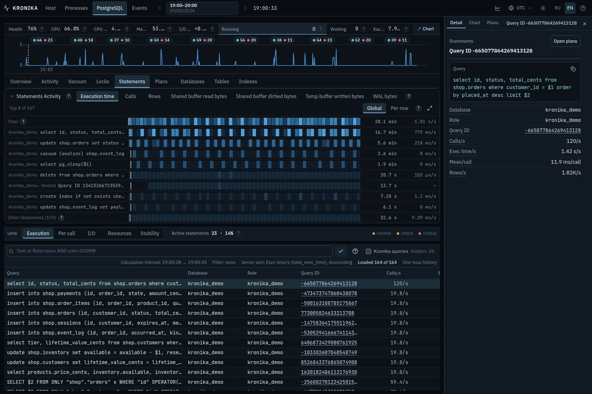
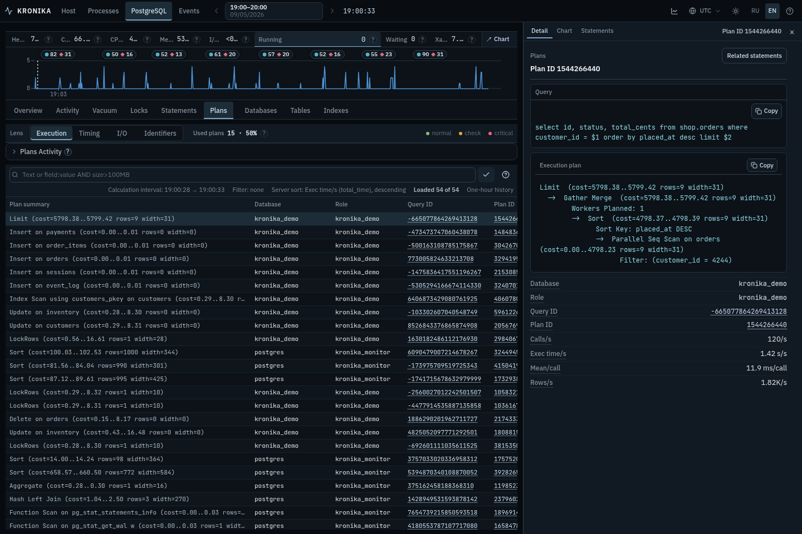
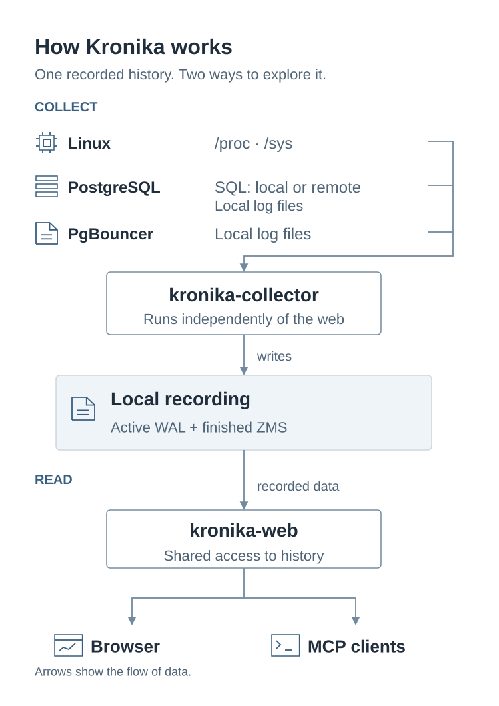
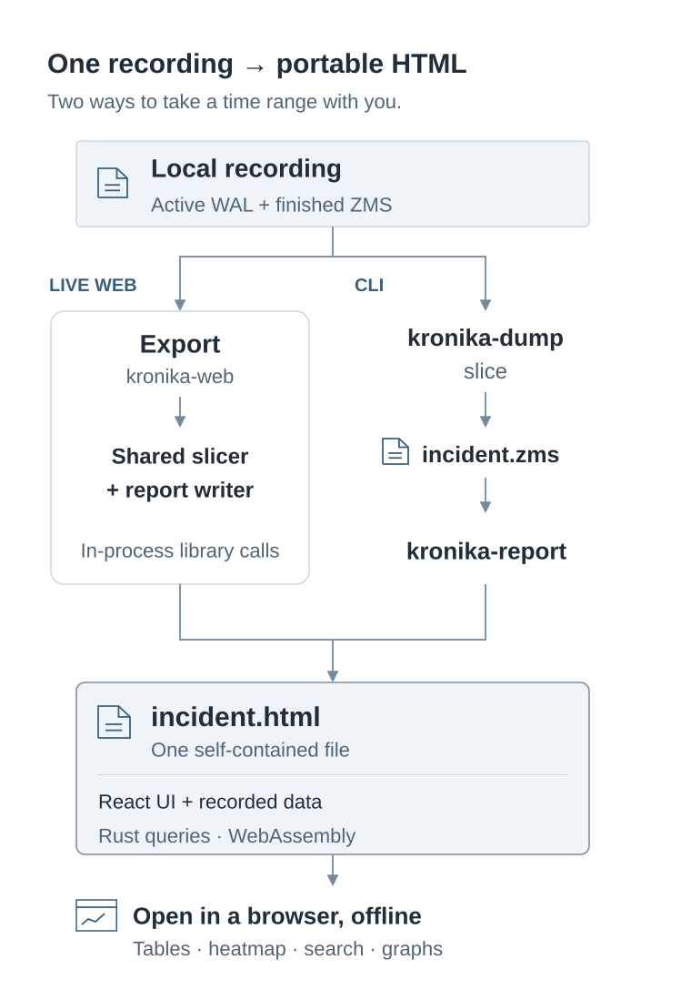

# Kronika

[Русская версия](README.ru.md)

Kronika records Linux metrics, PostgreSQL statistics, query plans and events
from PostgreSQL/PgBouncer logs. The collector runs on the monitored machine and
saves data to its disk. The web interface shows what happened during a selected
hour: resource use, individual processes and queries, locks and changes over time.


[Open the interactive preview](https://pgtoolz.github.io/Kronika/) ·
[Download the v1.0.0 HTML example](https://github.com/pgtoolz/Kronika/releases/download/v1.0.0/kronika-v1.0.0.html).

A recorded hour, 5 September 2026, 19:00–20:00 UTC:
[Processes](https://pgtoolz.github.io/Kronika/reports/kronika-v1.0.0.html?at=1788634833931637&view=processes) · [Statements](https://pgtoolz.github.io/Kronika/reports/kronika-v1.0.0.html?at=1788634833931637&view=pg.statements) · [Plans](https://pgtoolz.github.io/Kronika/reports/kronika-v1.0.0.html?at=1788634833931637&view=pg.plans) · [Host](https://pgtoolz.github.io/Kronika/reports/kronika-v1.0.0.html?at=1788634833931637&view=host).

## Install and run

Download Kronika v1.0.0 for [Linux x86-64](https://github.com/pgtoolz/Kronika/releases/download/v1.0.0/kronika-1.0.0-x86_64-unknown-linux-musl.tar.gz)
or [Linux ARM64](https://github.com/pgtoolz/Kronika/releases/download/v1.0.0/kronika-1.0.0-aarch64-unknown-linux-musl.tar.gz).
Follow the [installation guide](INSTALL.md) to verify and install the archive,
or [build from source](docs/build.md). The archive contains `kronika-collector`,
`kronika-web`, `kronika-dump`, and `kronika-report`.

Choose one collector command below: Linux only, or Linux with PostgreSQL.
The examples save recordings in `/var/lib/kronika`; collector creates the
directory if needed.

### Linux only

```sh
sudo env KRONIKA_STORAGE_DIR=/var/lib/kronika \
  /usr/local/bin/kronika-collector
```

### Linux and PostgreSQL

To collect PostgreSQL data, supply its connection string in `KRONIKA_PG_DSNS`
when starting collector. Use a PostgreSQL account with the
[monitoring privileges](INSTALL.md#5-postgresql).

For local PostgreSQL that shares collector's CPU limits:

```sh
sudo env KRONIKA_STORAGE_DIR=/var/lib/kronika \
  KRONIKA_PG_DSNS='host=127.0.0.1 port=5432 user=kronika_monitor password=replace-with-password dbname=postgres' \
  /usr/local/bin/kronika-collector
```

In this case, leave `KRONIKA_POSTGRES_EFFECTIVE_CPUS` unset: Kronika calculates
CPU capacity from the recorded machine or container data.

For PostgreSQL on another machine or with different CPU limits, use that
server's CPU count for the Health calculation. For example, a remote server
with 4 CPUs:

```sh
sudo env KRONIKA_STORAGE_DIR=/var/lib/kronika \
  KRONIKA_PG_DSNS='host=pg.example.net port=5432 user=kronika_monitor password=replace-with-password dbname=postgres' \
  KRONIKA_POSTGRES_EFFECTIVE_CPUS=4 \
  /usr/local/bin/kronika-collector
```

Separate containers on the same host can have different CPU limits.
The [CPU capacity reference](bins/kronika-collector/README.md#postgresql-cpu-capacity)
explains automatic and explicit capacity. PostgreSQL collection itself does
not require an explicit CPU count.

### Open the web interface

With your chosen collector running, start web in a second terminal over the
same data directory. Use `KRONIKA_WEB_SOURCES=1` for Linux only, or change it
to `3` for Linux and PostgreSQL:

```sh
sudo env KRONIKA_STORAGE_DIR=/var/lib/kronika \
  KRONIKA_WEB_LISTEN=127.0.0.1:8080 \
  KRONIKA_WEB_SOURCES=1 \
  KRONIKA_WEB_USER=kronika \
  KRONIKA_WEB_PASSWORD='replace-with-a-random-password' \
  /usr/local/bin/kronika-web
```

Open <http://127.0.0.1:8080/> and sign in. Web reads new data while collector
runs. `Ctrl+C` stops either process; the recordings stay on disk.
[Systemd setup](docs/services.md) covers running both programs as services and
changing an existing service's configuration.

### Storage

For a PostgreSQL workload with roughly 500 tables and 3,000 indexes, estimate
**about 200 MB of compressed recordings per day**. Volume depends on collection
intervals and the number of recorded objects and distinct queries.

`KRONIKA_RETENTION=2147483648` sets the default **2 GiB** storage budget,
including journals and indexes. When the target is exceeded, the collector
automatically removes the oldest finished recordings and their indexes.
For **10 GiB**, set `KRONIKA_RETENTION=10737418240` (raw bytes).

`auto` and `auto:P` instead set a used-space percentage target for the whole
backing filesystem. See [storage configuration](bins/kronika-collector/README.md#storage)
for the rotation rules and automatic mode.

## Recorded data and views

The names below match sections in the interface.

| Domain | What you can inspect | Reference |
| --- | --- | --- |
| Processes | Command, state and process number (PID), CPU use, memory and disk reads/writes; process tree and hourly activity. | [Linux metrics](docs/metrics-linux.md) |
| Host | CPU, memory, time waiting for resources (PSI), network and disks, free space and device relationships; container resource limits and use. | [Linux metrics](docs/metrics-linux.md) |
| PostgreSQL sessions | Overview, Activity, Locks, Vacuum; session states and waits, blocking chains, query/transaction durations and table cleanup progress. | [PostgreSQL metrics](docs/metrics-postgresql.md) |
| PostgreSQL SQL | Statements and Plans; calls, execution/planning time, page and temporary-file reads, write-ahead log (WAL) output, SQL and plan text. | [PostgreSQL metrics](docs/metrics-postgresql.md) |
| PostgreSQL objects | Databases, Tables, Indexes and settings; size, reads and changes, maintenance and transaction ages; grouping by database, schema and tablespace. | [PostgreSQL metrics](docs/metrics-postgresql.md) |
| Events | Grouped PostgreSQL/PgBouncer log events, occurrences, durations and recorded context; metric marks. | [Views and controls](docs/features.md) |
| Time and charts | Choose an hour and a time within it; view changes, activity maps, totals and the distribution of measurements. | [Time and calculations](docs/metrics-time.md) |

[Views and controls](docs/features.md) explains how to select measurements, group,
search and sort rows, inspect details in Inspector, view charts and export. The
[operator guide](docs/operator-guide.md) contains four worked examples from
the preview recording.





## Collection and access

<picture>
  <source media="(prefers-color-scheme: dark)" srcset="docs/images/architecture-dark.svg">
  
</picture>

The default collection intervals are 5 seconds for processes, 10 seconds for
core Linux metrics, 30 seconds for PostgreSQL metrics, and 300 seconds for
tables and indexes.
[Collector configuration](bins/kronika-collector/README.md) defines source
selection, intervals, access permissions and removal of old recordings.

The web server serves the browser, HTTP API and MCP at one address and port.
MCP is a protocol through which an AI client can read stored data. The **AI**
panel provides connection settings. [MCP tools](docs/features.md#mcp) return
values at a chosen time, objects ranked by a measurement, field descriptions,
events and complete row details.

## Portable HTML export

**Export** saves a selected interval of your recording as one interactive HTML
file. It embeds the interface, data and a Rust/WebAssembly program to process
queries on the browser’s main thread. Opening the file requires no server or
network connection.

<picture>
  <source media="(prefers-color-scheme: dark)" srcset="docs/images/report-export-dark.svg">
  
</picture>

[kronika-dump](bins/kronika-dump/README.md) inspects storage and extracts an
interval into a standalone ZMS recording; [kronika-report](bins/kronika-report/README.md)
converts that recording into HTML. Offline reports provide tables, search,
charts and activity maps.

## Documentation

- Setup: [Install](INSTALL.md) · [Archives and CI](docs/releases.md) · [Services](docs/services.md) · [Storage failures](docs/storage-recovery.md) · [Source build](docs/build.md)
- Reference: [Controls](docs/features.md) · [Time](docs/metrics-time.md) · [Linux](docs/metrics-linux.md) · [PostgreSQL](docs/metrics-postgresql.md) · [MCP](docs/mcp-clients.md)
- Programs: [Collector](bins/kronika-collector/README.md) · [Web](bins/kronika-web/README.md) · [Dump](bins/kronika-dump/README.md) · [Report](bins/kronika-report/README.md)
- Recorded fields: [Linux](docs/type-registry/os.md) · [PostgreSQL metrics](docs/type-registry/postgresql-metrics.md) · [PostgreSQL events](docs/type-registry/postgresql.md) · [PgBouncer events](docs/type-registry/pgbouncer.md)
- Development: [Segment format](crates/kronika-format/README.md) · [Development demo](bins/kronika-demo/README.md)

[MIT License](LICENSE).
